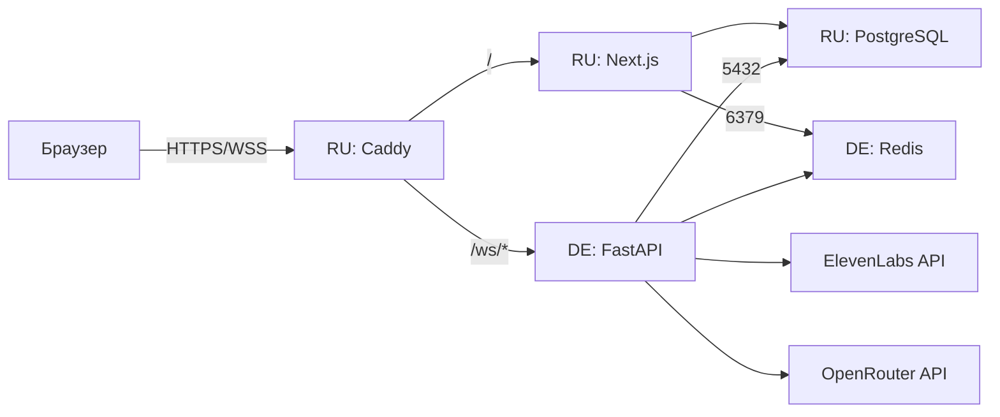

# Деплой: два сервера + автодеплой через GitHub Actions

Продакшен разнесён на два VPS:

- **RU-сервер** (Timeweb, `5.129.206.63`) — Caddy (HTTPS/WSS), Next.js,
  PostgreSQL. Пользователи ходят на https://5.129.206.63.nip.io.
- **DE-сервер** (`103.7.55.214`) — голосовой FastAPI backend (STT → LLM → TTS)
  и Redis (кэш сессий, ws-токены). Вынесен за рубеж: API ElevenLabs
  недоступен с российских IP.

Caddy на RU проксирует `/ws/*` на DE (порт 8000). Backend на DE пишет
в PostgreSQL на RU (порт 5432, файрвол — только IP DE). Redis — локально
на DE; frontend на RU подключается к нему по `103.7.55.214:6379` (пароль).



---

## Проверки перед мержем (CI)

Каждый pull request запускает [.github/workflows/ci.yml](.github/workflows/ci.yml):
типы и ESLint во frontend, `pytest` в backend. Эти проверки стоит держать
обязательными в правилах защиты ветки `main` — она уезжает прямо в прод.

## Автодеплой (CD)

Каждый push в `main` запускает [.github/workflows/deploy.yml](.github/workflows/deploy.yml):

1. **build** — сборка Docker-образов `ai-trainer-frontend` и `ai-trainer-backend`
   на раннерах GitHub и push в Docker Hub (решает проблему медленного npm на VPS).
2. **deploy-de** — SSH на DE, `~/ai-trainer`.
3. **deploy-ru** — SSH на RU, `~/ai-salesperson-trainer` (плюс `git pull`).

Оба деплой-шага делают одно и то же: логинятся в Docker Hub, тянут **только
образ приложения** и проверяют, что контейнер поднялся именно на свежем образе.

> Почему так. Раньше серверы ходили в Docker Hub анонимно и тянули все образы
> сразу. Анонимные загрузки лимитированы: после нескольких выкаток подряд
> Hub ответил `429`, pull прервался вместе с образом приложения, `up -d`
> оставил работать старый контейнер — **а workflow отрапортовал успех**.
> Отсюда три правила: авторизация, pull только нужного образа (`caddy`,
> `postgres` и `redis` меняются раз в год, но тратят лимит) и явная сверка
> ID запущенного образа со свежим тегом. Молчаливо «успешный» деплой опаснее
> упавшего.

Для обновления продакшена достаточно `git push` — руками на серверы
ходить не нужно.

### Секреты репозитория (Settings → Secrets and variables → Actions)

| Секрет | Значение |
|---|---|
| `DOCKERHUB_USERNAME` | логин Docker Hub |
| `DOCKERHUB_TOKEN` | access token Docker Hub (Read & Write) |
| `RU_HOST` | IP RU-сервера |
| `DE_HOST` | IP DE-сервера |
| `DEPLOY_SSH_KEY` | приватный ключ для входа на оба сервера |

SSH-аутентификация — **по ключу** (`appleboy/ssh-action`, поле `key`); парольный
вход на серверах отключён. Ключ отдельный от людских: в `authorized_keys` он
подписан `github-actions-deploy` и отзывается независимо. Значения секретов
зашифрованы и маскируются в логах workflow.

---

## Разовая настройка серверов (уже выполнена)

### DE-сервер — голосовой backend + Redis

Всё живёт в отдельной папке `~/ai-trainer`, файлы других проектов не
затрагиваются. Порт 8000 защищён ws-токеном (без валидного токена
соединение закрывается с кодом 4001). Redis на 6379 — с `requirepass`.

```
~/ai-trainer/
├── docker-compose.yml   # РУЧНАЯ копия deploy/docker-compose.de.yml
├── .env                 # DOCKERHUB_USER, REDIS_PASSWORD
└── backend.env          # секреты backend (см. backend/.env.production.example)
```

> **Правки `deploy/docker-compose.de.yml` на DE сами не приезжают.** В отличие
> от RU, где деплой делает `git pull`, здесь `~/ai-trainer` — не репозиторий, и
> workflow только дёргает `docker compose pull && up -d`. Изменил compose —
> скопируй руками, иначе изменение уедет в git и молча не подействует:
>
> ```bash
> scp deploy/docker-compose.de.yml de:~/ai-trainer/docker-compose.yml
> ```
>
> Контейнеры пересоздадутся на ближайшей выкатке: `up -d` увидит, что
> конфигурация изменилась. Отдельный рестарт не нужен — он бы оборвал
> активные голосовые сессии.

`backend.env` — по шаблону [backend/.env.production.example](backend/.env.production.example):
ключи `LLM_*` и `ELEVENLABS_*`; `DATABASE_URL` — публичный IP RU (Postgres);
`REDIS_URL` — локальный `redis:6379` в compose-сети. `JWT_SECRET` совпадает
с frontend на RU.

Запуск вручную (обычно не нужен — делает workflow):

```bash
cd ~/ai-trainer && docker compose pull && docker compose up -d
```

### RU-сервер — frontend, БД, Caddy

Репозиторий в `~/ai-salesperson-trainer`, стек — [docker-compose.prod.yml](docker-compose.prod.yml).

Файлы окружения:

- `.env` (корень) — по [.env.production.example](.env.production.example): `DOMAIN`,
  `ACME_EMAIL`, `POSTGRES_*`, `BACKEND_UPSTREAM=<DE_IP>:8000`,
  `DOCKERHUB_USER`.
- `frontend/.env` — по [frontend/.env.production.example](frontend/.env.production.example);
  `REDIS_URL` — на DE (`redis://:ПАРОЛЬ@103.7.55.214:6379`).

Согласованность значений:

| Значение | Где должно совпадать |
|---|---|
| `POSTGRES_PASSWORD` (`.env` RU) | `DATABASE_URL` в `frontend/.env` (RU) и `backend.env` (DE) |
| `REDIS_PASSWORD` (`~/ai-trainer/.env` DE) | `REDIS_URL` в `frontend/.env` (RU) и `backend.env` (DE) |
| `JWT_SECRET` | одинаковый в `frontend/.env` (RU) и `backend.env` (DE) |
| `DOMAIN` (`.env` RU) | `FASTAPI_WS_URL=wss://<domain>` в `frontend/.env` |

#### Файрвол: Postgres на RU только для DE

Порт 5432 опубликован наружу (нужен DE-backend), поэтому доступ
ограничен на уровне iptables (цепочка `DOCKER-USER` — обычный ufw
Docker обходит):

```bash
# правила добавляет скрипт (идемпотентно):
/usr/local/sbin/docker-user-firewall.sh
# автозапуск после ребута/рестарта Docker:
systemctl status docker-user-firewall.service
```

Скрипт дропает входящие на 5432 с любых адресов, кроме IP DE-сервера.
Трафик внутри compose-сети (frontend → postgres) не затрагивается.

#### Ограничение журнала systemd (оба сервера)

Диски у серверов по 30 ГБ, а `journald` по умолчанию занимает до 10% раздела.
На DE журнал успел вырасти до 2.4 ГБ — почти весь из-за перебора паролей по
SSH. Ограничение выставлено в `/etc/systemd/journald.conf`:

```bash
# SystemMaxUse=200M в [Journal], затем:
systemctl restart systemd-journald
journalctl --disk-usage   # проверка
```

Ротацию логов контейнеров задавать не нужно — она в самих compose-файлах
(якорь `x-logging`, 10 МБ × 3 файла на сервис). Правило применяется при
пересоздании контейнера, то есть на ближайшей выкатке.

---

## Доступ к серверам: только по SSH-ключу

Парольный вход отключён на обоих серверах (2026-07-23). До этого боты
перебирали пароль ~12 000 раз в сутки; подобрать его достаточно один раз, а
дальше это полный root-доступ к базе и ключам ElevenLabs/OpenRouter.

Настройки лежат в `/etc/ssh/sshd_config.d/01-hardening.conf`:

```
PasswordAuthentication no
KbdInteractiveAuthentication no   # иначе PAM спросит пароль в обход
PermitRootLogin prohibit-password # root по ключу можно, по паролю нельзя
```

> **Префикс `01-` обязателен, и это не косметика.** `sshd` подключает
> `sshd_config.d/*.conf` в начале конфига, читает файлы по алфавиту и для
> большинства ключей берёт **первое** встреченное значение, а не последнее.
> Рядом лежит `50-cloud-init.conf` с `PasswordAuthentication yes`, поэтому
> привычный `99-hardening.conf` был бы прочитан позже и **молча не
> подействовал**: выглядело бы как «закрыто», а сервер стоял бы нараспашку.

Отсюда правило проверки: смотреть не на наличие файла, а на итог —

```bash
sshd -t                       # синтаксис; упало — конфиг не применять
sshd -T | grep -E 'passwordauthentication|kbdinteractive|permitrootlogin'
```

### Как менять настройки SSH и не запереть себя снаружи

Перед правкой ставим автооткат: не отменим за 10 минут — сервер вернёт всё сам.

```bash
systemd-run --on-active=600 --unit=ssh-rollback \
  /bin/sh -c 'rm -f /etc/ssh/sshd_config.d/01-hardening.conf; systemctl restart ssh'
# ... правим, проверяем sshd -t и sshd -T, перезапускаем ssh ...
# ... из ОТДЕЛЬНОГО соединения убеждаемся, что вход работает ...
systemctl stop ssh-rollback.timer   # только теперь снимаем страховку
```

Перезапуск: на RU `systemctl restart ssh`; на DE (Ubuntu 24.04, socket-активация)
ещё и `ssh.socket`, иначе настройки подхватятся не сразу.

Последний рубеж — **веб-консоль хостера**: она работает мимо SSH, и пароль root
там продолжает действовать даже при `PasswordAuthentication no`.

### Добавить доступ новому человеку

Он генерирует пару у себя (`ssh-keygen -t ed25519`) и присылает **публичную**
часть — `.pub`. Приватную не передаёт никому.

```bash
ssh ru "echo 'ssh-ed25519 AAAA... имя@машина' >> ~/.ssh/authorized_keys"
ssh de "echo 'ssh-ed25519 AAAA... имя@машина' >> ~/.ssh/authorized_keys"
```

Отозвать — удалить строку из `~/.ssh/authorized_keys` на обоих серверах.
Ключ CI подписан `github-actions-deploy`; он отдельный от людских специально,
чтобы отзывался независимо.

### fail2ban

Банит адреса, долбящиеся в SSH, на час после 5 неудач за 10 минут. После
перехода на ключи это **не защита от взлома** (угадывать нечего), а разгрузка
логов и CPU. Конфиг — `/etc/fail2ban/jail.local`, различия серверов:

| | RU (22.04) | DE (24.04) |
|---|---|---|
| источник | `/var/log/auth.log` | журнал systemd, нужен `backend = systemd` |
| чем банит | iptables | nftables (`nft list ruleset`) |

На DE файла `auth.log` нет вовсе: без явного `backend` джейл запустится и будет
молчать. Обеим машинам задан `mode = aggressive` — после отключения паролей
боты дают `Connection closed by authenticating user ... [preauth]`, а обычный
режим ловит только `Failed password` и `Invalid user`.

Проверять результатом, а не статусом сервиса:

```bash
fail2ban-client status sshd   # счётчик Total failed должен расти
```

---

## Проверка после деплоя

1. Workflow в GitHub Actions зелёный (вкладка Actions).
2. https://5.129.206.63.nip.io открывается, логин работает.
3. После входа открывается главная: приветствие, «Совет дня», статистика.
4. «Начать тренировку» → доступ к микрофону → фраза → голосовой ответ.
5. Логи backend на DE: `cd ~/ai-trainer && docker compose logs -f backend`
   (подключение к Postgres на RU, локальный Redis, тайминги STT/LLM/TTS).

## Наполнение данными

Все команды — на RU-сервере, из `~/ai-salesperson-trainer`. Миграции Prisma
накатываются автоматически при старте контейнера, наливать данные нужно руками.

```bash
# 1. Советы дня и мотивации — ОБЯЗАТЕЛЬНО, иначе блок на главной пуст
docker compose -f docker-compose.prod.yml exec frontend npm run seed:content

# 2. Пациенты и типы тренировки — ОБЯЗАТЕЛЬНО: в них лежат промпты,
#    без которых backend откажется начинать разговор
docker compose -f docker-compose.prod.yml exec frontend npm run seed:patients
docker compose -f docker-compose.prod.yml exec frontend npm run seed:training
docker compose -f docker-compose.prod.yml exec frontend npm run seed:achievements
docker compose -f docker-compose.prod.yml exec -e TEAM_PASSWORD=... frontend npm run seed:team

# 3. Пользователь (email, пароль, имя, фамилия)
docker compose -f docker-compose.prod.yml exec frontend npm run create-user

# 4. Демо-аккаунт с историей разговоров и оценками — для показов
docker compose -f docker-compose.prod.yml exec frontend npm run seed:demo
```

`seed:demo` привязывает разговоры к пациенту из `seed:patients`, поэтому
порядок менять нельзя — без пациентов он завершится с ошибкой.

Промпты пациентов и типов тренировки живут в коде сидов (`frontend/scripts/`),
а не в базе: источник правды — репозиторий. Оба скрипта **перезаписывают**
промпты при каждом запуске, поэтому править их напрямую в БД бесполезно —
изменения потеряются на следующем сиде.

`seed:demo` печатает сгенерированный пароль один раз. Чтобы задать свой:
`... exec -e DEMO_PASSWORD=... -e HEAD_PASSWORD=... frontend npm run seed:demo`.
Второй пароль — от аккаунта руководителя (`head@podhod.tech`, режим РОП).
Скрипт идемпотентный
и трогает только демо-аккаунт.

> Разбора разговоров пока нет, поэтому у настоящих разговоров не будет оценок —
> блоки «Прогресс» и «средняя оценка» покажут пустое состояние. Демо-аккаунт
> существует именно для того, чтобы показывать заполненный интерфейс.

## Полезные команды

```bash
# RU: статус и логи
docker compose -f docker-compose.prod.yml ps
docker compose -f docker-compose.prod.yml logs -f caddy
docker compose -f docker-compose.prod.yml logs -f frontend

# DE: статус и логи backend + redis
cd ~/ai-trainer && docker compose ps && docker compose logs -f backend

# RU: остановить всё (данные сохраняются)
docker compose -f docker-compose.prod.yml down
```

---

## Чек-лист безопасности

- Вход по SSH — **только по ключу**, на обоих серверах; fail2ban включён и
  в автозапуске (`systemctl is-enabled fail2ban`). Подробности — в разделе
  «Доступ к серверам».
- Деплой ходит на серверы по ключу `DEPLOY_SSH_KEY`, не по паролю.
- `.env`, `frontend/.env`, `backend.env` **не** коммитятся.
- `JWT_SECRET`, `POSTGRES_PASSWORD`, `REDIS_PASSWORD` — длинные случайные.
- 5432 на RU открыт **только** для IP DE-сервера (iptables `DOCKER-USER`).
- 6379 на DE — с `requirepass`; первичные данные в PostgreSQL на RU.
- Порт 8000 на DE открыт, но WebSocket требует одноразовый ws-токен;
  `/health` не раскрывает данных.
- Куки выставляются с флагом `Secure` (только HTTPS).
