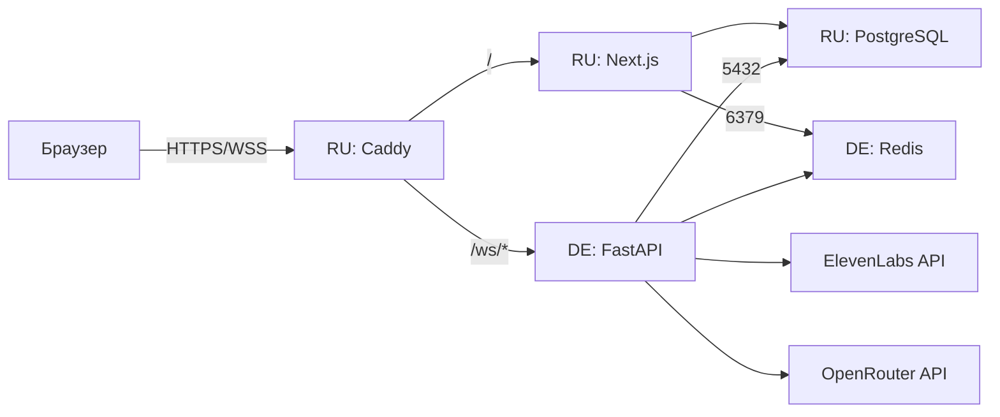

# Деплой: два сервера + автодеплой через GitHub Actions

Продакшен разнесён на два VPS:

- **RU-сервер** (Timeweb, `5.129.206.63`) — Caddy (HTTPS/WSS), Next.js,
  PostgreSQL. Пользователи ходят на https://5.129.206.63.nip.io.
- **DE-сервер** (`103.7.55.214`) — голосовой FastAPI backend (STT → LLM → TTS)
  и Redis (кэш сессий, ws-токены). Вынесен за рубеж: API ElevenLabs
  недоступен с российских IP.

Caddy на RU проксирует `/ws/*` на DE (порт 8000). Backend на DE пишет
в PostgreSQL на RU (порт 5432, файрвол — только IP DE). Redis — локально
на DE; frontend на RU подключается к нему по `103.7.55.214:6379` (пароль).



---

## Автодеплой (CI/CD)

Каждый push в `main` запускает [.github/workflows/deploy.yml](.github/workflows/deploy.yml):

1. **build** — сборка Docker-образов `ai-trainer-frontend` и `ai-trainer-backend`
   на раннерах GitHub и push в Docker Hub (решает проблему медленного npm на VPS).
2. **deploy-de** — SSH на DE: `docker compose pull && up -d` в `~/ai-trainer`.
3. **deploy-ru** — SSH на RU: `git pull`, `docker compose pull && up -d`
   в `~/ai-salesperson-trainer`.

Для обновления продакшена достаточно `git push` — руками на серверы
ходить не нужно.

### Секреты репозитория (Settings → Secrets and variables → Actions)

| Секрет | Значение |
|---|---|
| `DOCKERHUB_USERNAME` | логин Docker Hub |
| `DOCKERHUB_TOKEN` | access token Docker Hub (Read & Write) |
| `RU_HOST`, `RU_SSH_PASSWORD` | IP и root-пароль RU-сервера |
| `DE_HOST`, `DE_SSH_PASSWORD` | IP и root-пароль DE-сервера |

SSH-аутентификация — по паролю (`appleboy/ssh-action`). Значения секретов
зашифрованы и маскируются в логах workflow.

---

## Разовая настройка серверов (уже выполнена)

### DE-сервер — голосовой backend + Redis

Всё живёт в отдельной папке `~/ai-trainer`, файлы других проектов не
затрагиваются. Порт 8000 защищён ws-токеном (без валидного токена
соединение закрывается с кодом 4001). Redis на 6379 — с `requirepass`.

```
~/ai-trainer/
├── docker-compose.yml   # копия deploy/docker-compose.de.yml
├── .env                 # DOCKERHUB_USER, REDIS_PASSWORD
└── backend.env          # секреты backend (см. backend/.env.production.example)
```

`backend.env` — по шаблону [backend/.env.production.example](backend/.env.production.example):
ключи `LLM_*` и `ELEVENLABS_*`; `DATABASE_URL` — публичный IP RU (Postgres);
`REDIS_URL` — локальный `redis:6379` в compose-сети. `JWT_SECRET` совпадает
с frontend на RU.

Запуск вручную (обычно не нужен — делает workflow):

```bash
cd ~/ai-trainer && docker compose pull && docker compose up -d
```

### RU-сервер — frontend, БД, Caddy

Репозиторий в `~/ai-salesperson-trainer`, стек — [docker-compose.prod.yml](docker-compose.prod.yml).

Файлы окружения:

- `.env` (корень) — по [.env.prod.example](.env.prod.example): `DOMAIN`,
  `ACME_EMAIL`, `POSTGRES_*`, `BACKEND_UPSTREAM=<DE_IP>:8000`,
  `DOCKERHUB_USER`.
- `frontend/.env` — по [frontend/.env.production.example](frontend/.env.production.example);
  `REDIS_URL` — на DE (`redis://:ПАРОЛЬ@103.7.55.214:6379`).

Согласованность значений:

| Значение | Где должно совпадать |
|---|---|
| `POSTGRES_PASSWORD` (`.env` RU) | `DATABASE_URL` в `frontend/.env` (RU) и `backend.env` (DE) |
| `REDIS_PASSWORD` (`~/ai-trainer/.env` DE) | `REDIS_URL` в `frontend/.env` (RU) и `backend.env` (DE) |
| `JWT_SECRET` | одинаковый в `frontend/.env` (RU) и `backend.env` (DE) |
| `DOMAIN` (`.env` RU) | `FASTAPI_WS_URL=wss://<domain>` в `frontend/.env` |

#### Файрвол: Postgres на RU только для DE

Порт 5432 опубликован наружу (нужен DE-backend), поэтому доступ
ограничен на уровне iptables (цепочка `DOCKER-USER` — обычный ufw
Docker обходит):

```bash
# правила добавляет скрипт (идемпотентно):
/usr/local/sbin/docker-user-firewall.sh
# автозапуск после ребута/рестарта Docker:
systemctl status docker-user-firewall.service
```

Скрипт дропает входящие на 5432 с любых адресов, кроме IP DE-сервера.
Трафик внутри compose-сети (frontend → postgres) не затрагивается.

---

## Проверка после деплоя

1. Workflow в GitHub Actions зелёный (вкладка Actions).
2. https://5.129.206.63.nip.io открывается, логин работает.
3. «Начать разговор» → доступ к микрофону → фраза → голосовой ответ.
4. Логи backend на DE: `cd ~/ai-trainer && docker compose logs -f backend`
   (подключение к Postgres на RU, локальный Redis, тайминги STT/LLM/TTS).

## Создать пользователя для тестировщика

На RU-сервере:

```bash
cd ~/ai-salesperson-trainer
docker compose -f docker-compose.prod.yml exec frontend npx ts-node create-user.ts
```

## Полезные команды

```bash
# RU: статус и логи
docker compose -f docker-compose.prod.yml ps
docker compose -f docker-compose.prod.yml logs -f caddy
docker compose -f docker-compose.prod.yml logs -f frontend

# DE: статус и логи backend + redis
cd ~/ai-trainer && docker compose ps && docker compose logs -f backend

# RU: остановить всё (данные сохраняются)
docker compose -f docker-compose.prod.yml down
```

---

## Чек-лист безопасности

- `.env`, `frontend/.env`, `backend.env` **не** коммитятся.
- `JWT_SECRET`, `POSTGRES_PASSWORD`, `REDIS_PASSWORD` — длинные случайные.
- 5432 на RU открыт **только** для IP DE-сервера (iptables `DOCKER-USER`).
- 6379 на DE — с `requirepass`; первичные данные в PostgreSQL на RU.
- Порт 8000 на DE открыт, но WebSocket требует одноразовый ws-токен;
  `/health` не раскрывает данных.
- Куки выставляются с флагом `Secure` (только HTTPS).
